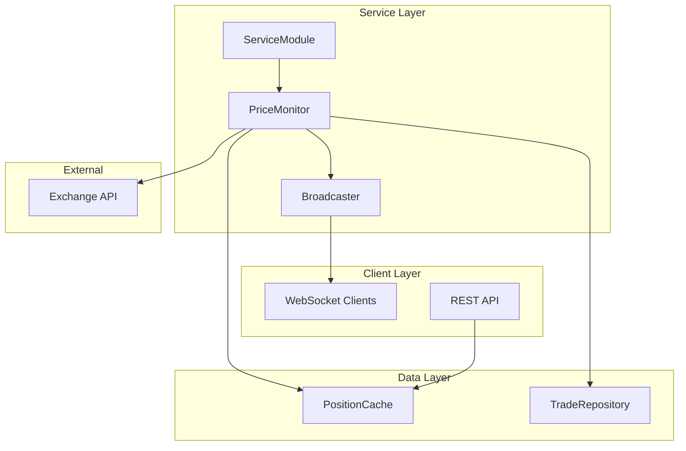
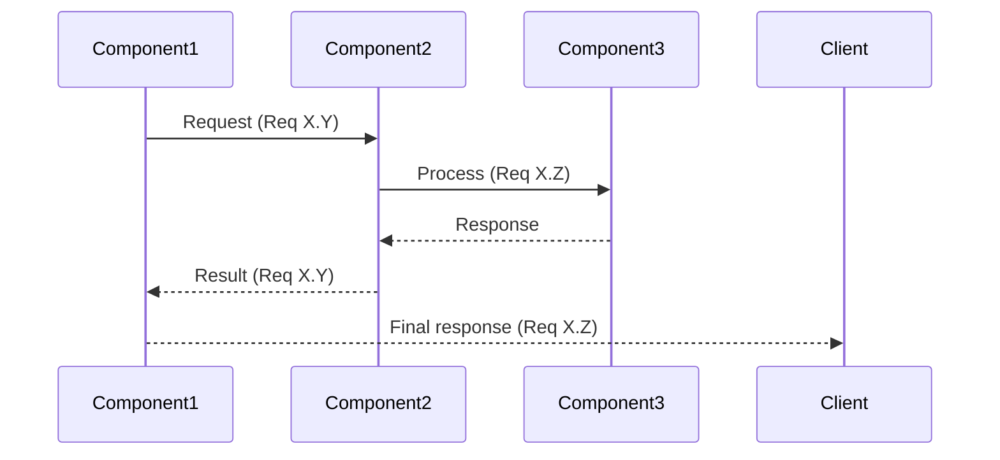

# Design Document

## Overview

### Purpose
[Link to requirements introduction, summarize technical approach]

### Design Principles
1. [Principle]: Rationale and impact on implementation
2. [Principle]: Trade-offs considered and decision reasoning

### Architectural Patterns
- [Pattern name]: Why selected, where applied
- [Pattern name]: Benefits for this specific use case

## System Architecture

### Component Diagram


### Component Specifications

#### Component: [ComponentName]
**Purpose**: [Single responsibility]
**Location**: `backend/services/component_file.py`

**Interface**:
```python
class ComponentName:
    def __init__(self, dependency1, dependency2, config):
        """Initialize with dependencies and configuration"""

    async def start(self) -> None:
        """Begin operation - Implements Req X.Y, X.Z"""

    async def stop(self) -> None:
        """Graceful shutdown - Implements Req X.Y"""

    def get_data(self, id: str) -> Optional[DataType]:
        """Retrieve data - Implements Req X.Y, X.Z"""
```

**Dependencies**:
- [Dependency]: Purpose and requirement reference
- [Dependency]: Purpose and requirement reference

**Error Handling**:
- [Error condition]: Response strategy and requirement reference
- [Error condition]: Response strategy and requirement reference

[Continue for each component...]

## Data Architecture

### Data Models

#### [ModelName]
**Location**: `backend/models/model_file.py`
**Purpose**: [Model purpose and context]

```python
@dataclass
class ModelName:
    field1: str           # Description
    field2: float         # Description
    field3: datetime      # Description
    field4: Optional[str] # Description

    def to_dict(self) -> dict:
        """Serialize for JSON/WebSocket transmission (Req X.Y)"""
```

### Data Flow Sequences

#### [FlowName]


[Continue with other flows, integration points, API contracts, database schema...]

## Configuration Architecture

### Configuration Model
**Location**: `backend/core/config.py`
**Requirements Coverage**: [List of requirement numbers]

```python
@dataclass
class FeatureConfig:
    parameter1: float = 5.0  # Seconds (Req X.Y)
    parameter2: int = 10     # Count (Req X.Z)
    parameter3: str = "default"  # Description (Req X.Y)

    def validate(self) -> None:
        """Ensure valid configuration (Req X.Z)"""
        if not 1 <= self.parameter1 <= 60:
            raise ValueError(f"Invalid parameter: {self.parameter1}")
```

## Technical Decisions

### Decision 1: [Decision Title]
**Options Considered**:
1. [Option 1]: Description and trade-offs
2. [Option 2]: Description and trade-offs
3. **[Selected Option]** ✓

**Rationale**:
- [Reason 1 with requirement impact]
- [Reason 2 with requirement impact]
- [Reason 3 with requirement impact]

**Risk Mitigation**:
- [Risk 1] and mitigation strategy
- [Risk 2] and mitigation strategy

[Continue with other decisions...]

## Testing Strategy

### Test Coverage Requirements
- Unit Tests: [Percentage]% coverage for business logic
- Integration Tests: [Scope] of API endpoints and workflows
- Performance Tests: [Metrics] concurrent connections/operations
- Failure Tests: [Types] of network outages, invalid data, timeouts

### Test Implementation Mapping
- `test_[module].py`: Requirements [X.*], [Y.*]
- `test_[integration].py`: Requirements [Z.*], [W.*]
- `test_[feature].py`: Requirement [V.*]

Approval Gate:
"Design complete with [N] components specified, [M] sequence diagrams, and requirement traceability matrix. Each component maps to specific requirement criteria. Type 'approved' to generate implementation tasks."