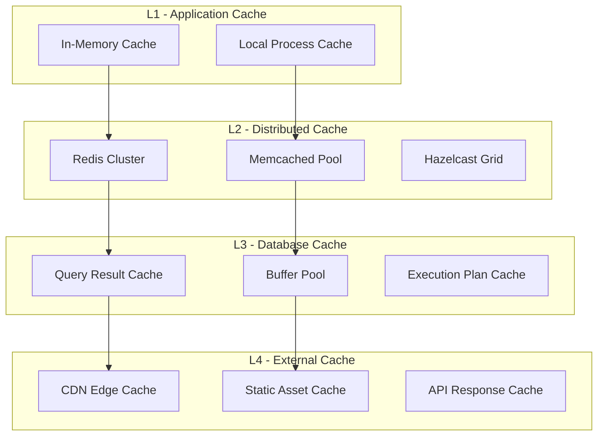
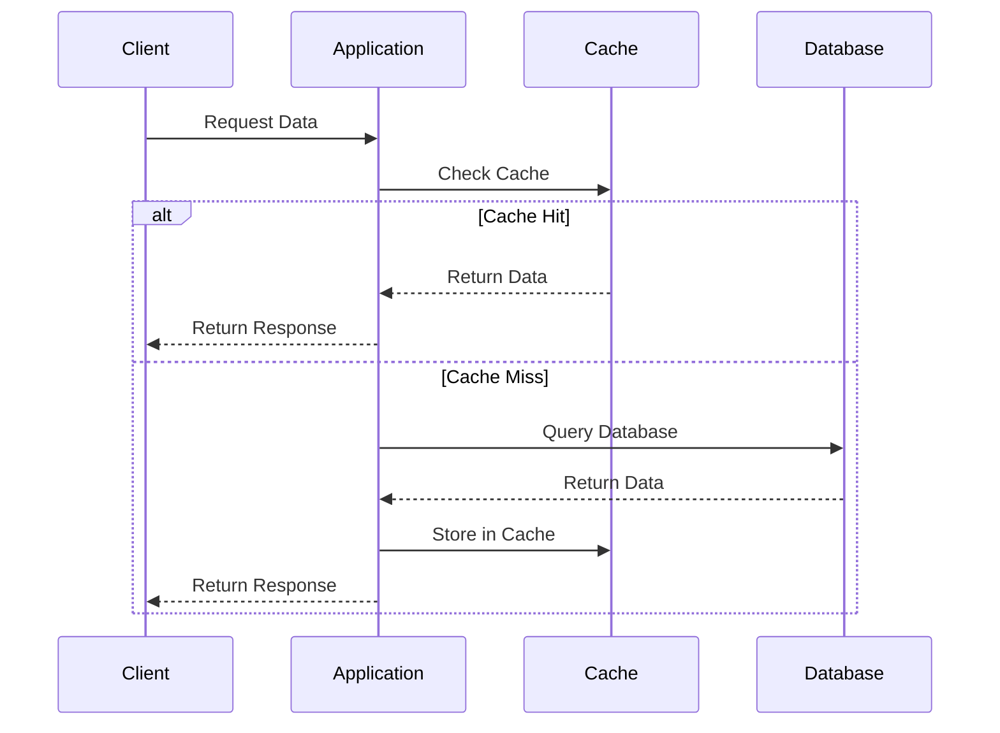
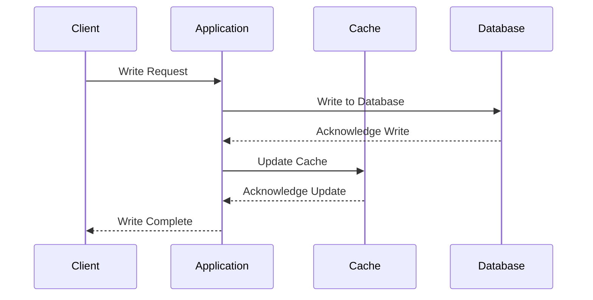
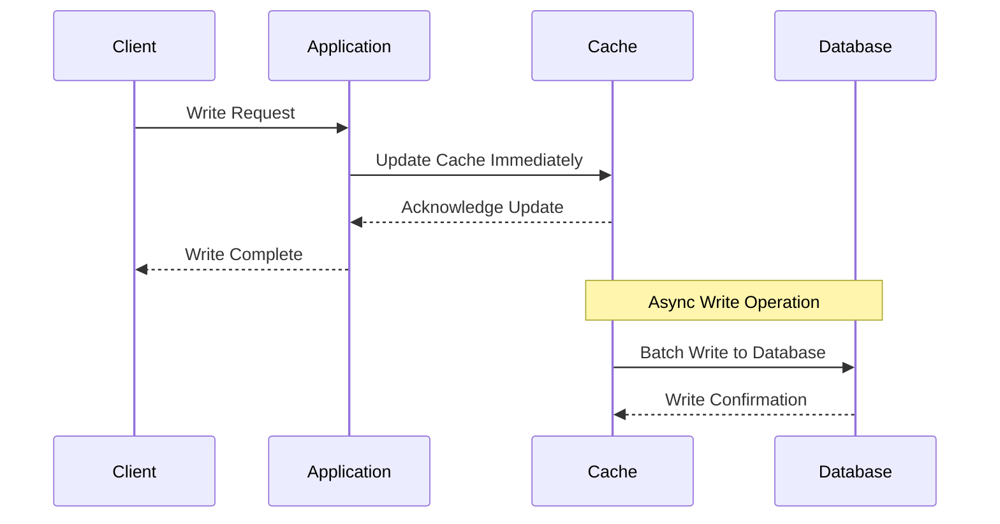
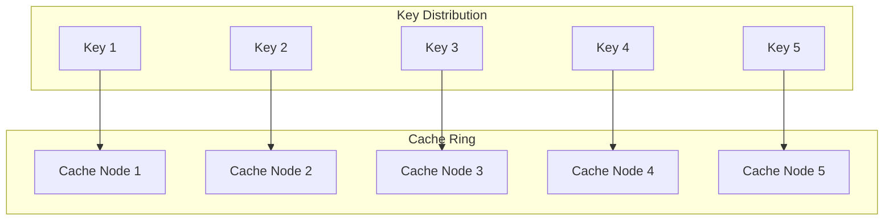

# Caching Strategies Guide

## Overview

This guide provides comprehensive caching strategies and patterns for optimizing data flow performance. It covers multi-layer caching architectures, invalidation strategies, performance optimization techniques, and best practices for different system types.

## Caching Architecture Patterns

### 1. Multi-Layer Caching Hierarchy


### 2. Cache-Aside Pattern


**When to Use**: Read-heavy workloads, user-specific data, configuration data
**Advantages**: Simple implementation, cache control, data consistency
**Considerations**: Cache stampede protection, write-through updates

### 3. Write-Through Pattern


**When to Use**: Critical data, consistency requirements, financial systems
**Advantages**: Data consistency, immediate cache updates
**Considerations**: Write latency, cache management complexity

### 4. Write-Behind Pattern


**When to Use**: High-write throughput systems, analytics, logging
**Advantages**: Fast writes, batch processing efficiency
**Considerations**: Data durability, write ordering, failure recovery

## Cache Invalidation Strategies

### 1. Time-Based Invalidation
```yaml
TTL (Time To Live) Configuration:
  Short-lived Data:
    - Real-time prices: 60 seconds
    - Session data: 30 minutes
    - API responses: 5 minutes
    - User preferences: 24 hours

  Medium-lived Data:
    - User profiles: 1 hour
    - Configuration: 4 hours
    - Analytics data: 6 hours
    - Reference data: 12 hours

  Long-lived Data:
    - Static content: 24 hours
    - Historical data: 7 days
    - Archive data: 30 days
    - Master data: 1 year

  Implementation:
    - Set-EX: [Key expiration in seconds]
    - Set-PX: [Key expiration in milliseconds]
    - Expire-at: [Specific timestamp expiration]
    - Persistent Keys: [Manual invalidation only]
```

### 2. Event-Driven Invalidation
```yaml
Event Sources and Triggers:
  1. Data Update Events:
     - Database Triggers: [Change detection]
     - Message Queue Events: [Async notifications]
     - Webhook Callbacks: [External system updates]
     - Application Events: [Business logic triggers]

  2. User Action Events:
     - Profile Updates: [User preference changes]
     - Permission Changes: [Access control updates]
     - Settings Changes: [Configuration modifications]
     - Logout Events: [Session cleanup]

  3. System Events:
     - Deployments: [Cache warming]
     - Configuration Changes: [Global invalidation]
     - Maintenance Windows: [Planned invalidation]
     - Failover Events: [Cache synchronization]

  Invalidaton Patterns:
    - Immediate: [Synchronous invalidation]
    - Delayed: [Async processing]
    - Batched: [Group invalidation]
    - Conditional: [Rule-based invalidation]
```

### 3. Selective Invalidation Patterns
```yaml
Key Pattern Matching:
  1. Wildcard Patterns:
     - user:*: [All user-related keys]
     - ticker:*: [All ticker data]
     - config:*: [All configuration keys]
     - session:*: [All session keys]

  2. Tag-based Invalidation:
     - user:123:profile: [User profile cache]
     - user:123:preferences: [User preferences]
     - user:123:permissions: [User permissions]
     - Invalidate by tag: user:123

  3. Hierarchical Invalidation:
     - market:us:stocks:tech: [Specific market data]
     - market:us:stocks: [All US stocks]
     - market:us: [All US market data]
     - market: [All market data]

  Implementation Strategies:
    - Hash Tags: [Redis hash tagging]
    - Key Prefixes: [Hierarchical organization]
    - Metadata Storage: [Invalidation metadata]
    - Index Structures: [Fast key lookup]
```

## Cache Warming Strategies

### 1. Proactive Cache Warming
```yaml
Warming Strategies:
  1. Scheduled Warming:
     - Daily Warm-up: [Before peak hours]
     - Weekly Warm-up: [Weekly patterns]
     - Monthly Warm-up: [Monthly refresh]
     - Event-based: [Market open/close]

  2. Predictive Warming:
     - Usage Patterns: [ML-based prediction]
     - Seasonal Trends: [Historical analysis]
     - User Behavior: [Individual patterns]
     - Market Conditions: [External triggers]

  3. Priority-based Warming:
     - Hot Data: [High frequency access]
     - Critical Data: [Business critical]
     - User-specific: [Personalized data]
     - System Configuration: [Infrastructure data]

  Implementation:
    - Background Jobs: [Async warming]
    - Worker Queues: [Parallel processing]
    - Rate Limiting: [Resource management]
    - Progress Tracking: [Warming monitoring]
```

### 2. Lazy Loading with Warming
```yaml
Hybrid Strategy:
  1. Initial Load:
     - Request Time: [First access]
     - Cache Population: [Data storage]
     - Related Data: [Prefetching]
     - Background Loading: [Async completion]

  2. Progressive Warming:
     - Core Data: [Essential information]
     - Extended Data: [Additional details]
     - Analytics Data: [Usage optimization]
     - Historical Data: [Trend analysis]

  3. User-specific Warming:
     - Profile Loading: [Personal data]
     - Preference Loading: [User settings]
     - History Loading: [Recent activity]
     - Recommendation Loading: [Suggested content]

  Performance Considerations:
    - Load Time Optimization: [Fast initial response]
    - Resource Management: [Memory/CPU balancing]
    - Error Handling: [Failed warming recovery]
    - Cache Hit Ratio: [Effectiveness measurement]
```

## Cache Performance Optimization

### 1. Data Serialization Strategies
```yaml
Serialization Formats:
  1. Binary Formats:
     - Protocol Buffers: [High performance, schema evolution]
     - Avro: [Schema support, compression]
     - MessagePack: [Compact, fast]
     - FlatBuffers: [Zero-copy, high performance]

  2. Text Formats:
     - JSON: [Human readable, widely supported]
     - BSON: [Binary JSON, efficient]
     - CBOR: [Concise Binary Object Representation]
     - Smile: [Binary JSON for streaming]

  3. Custom Formats:
     - Domain-specific: [Optimized for business data]
     - Compressed: [Size optimization]
     - Versioned: [Backward compatibility]
     - Schema-less: [Flexibility]

  Selection Criteria:
    - Performance Requirements: [Speed vs size]
    - Data Complexity: [Nested structures]
    - Evolution Needs: [Schema changes]
    - Tool Support: [Ecosystem compatibility]
```

### 2. Compression Strategies
```yaml
Compression Algorithms:
  1. Fast Compression:
     - LZ4: [High speed, reasonable compression]
     - Snappy: [Fast, good compression]
     - LZO: [Very fast, moderate compression]
     - Use Case: [Real-time data]

  2. Balanced Compression:
     - ZSTD: [Good speed, excellent compression]
     - Brotli: [Web optimization]
     - LZMA: [Good balance]
     - Use Case: [General purpose]

  3. High Compression:
     - GZIP: [Good compression, widely supported]
     - BZIP2: [High compression, slow]
     - PPMd: [Text optimization]
     - Use Case: [Archive data]

  Compression Strategy:
    - Data Type Analysis: [Optimal algorithm selection]
    - Size Thresholds: [Compress only large objects]
    - CPU vs Trade-offs: [Performance balancing]
    - Cache Hit Ratio: [Compression effectiveness]
```

## Cache Distribution and Sharding

### 1. Consistent Hashing


### 2. Cache Clustering
```yaml
Cluster Configuration:
  1. Master-Slave:
     - Write Operations: [Master node]
     - Read Operations: [Slave nodes]
     - Failover: [Automatic promotion]
     - Replication: [Async/sync]

  2. Multi-Master:
     - Write Operations: [Any node]
     - Conflict Resolution: [Last write wins]
     - Consistency: [Eventual consistency]
     - Performance: [High write throughput]

  3. Sharded:
     - Data Distribution: [Hash-based]
     - Cross-shard Queries: [Complex queries]
     - Rebalancing: [Dynamic scaling]
     - Consistency: [Distributed transactions]

  Monitoring:
    - Node Health: [Availability tracking]
    - Data Distribution: [Load balancing]
    - Replication Lag: [Consistency monitoring]
    - Network Partitions: [Split-brain prevention]
```

## Cache Security Patterns

### 1. Data Protection
```yaml
Security Measures:
  1. Encryption:
     - At Rest: [Disk encryption]
     - In Transit: [TLS/SSL]
     - Key Management: [Secure key storage]
     - Algorithm Selection: [AES-256]

  2. Access Control:
     - Authentication: [Client verification]
     - Authorization: [Permission-based access]
     - Network Security: [Firewall rules]
     - Audit Logging: [Access tracking]

  3. Data Sanitization:
     - PII Redaction: [Personal data masking]
     - Sensitive Data: [Financial/health data]
     - Tokenization: [Data substitution]
     - Retention Policies: [Data lifecycle]

  Implementation:
    - Encryption in Transit: [TLS configuration]
    - Encryption at Rest: [File system encryption]
    - Key Rotation: [Regular key updates]
    - Compliance: [Regulatory requirements]
```

### 2. Cache Isolation
```yaml
Isolation Strategies:
  1. Multi-tenancy:
     - Key Prefixing: [Tenant separation]
     - Namespace Isolation: [Logical separation]
     - Resource Quotas: [Fair usage]
     - Performance Isolation: [SLA guarantees]

  2. Environment Separation:
     - Development: [Dev environment cache]
     - Staging: [Staging environment cache]
     - Production: [Production environment cache]
     - Testing: [Isolated test caches]

  3. Data Classification:
     - Public Data: [Open access]
     - Internal Data: [Company access]
     - Confidential Data: [Restricted access]
     - Secret Data: [Highly restricted]

  Access Control:
    - Role-based Access: [Permission levels]
    - API Keys: [Authentication tokens]
     - IP Whitelisting: [Network restrictions]
     - Rate Limiting: [Abuse prevention]
```

## Cache Monitoring and Analytics

### 1. Performance Metrics
```yaml
Key Metrics:
  1. Cache Performance:
     - Hit Ratio: [Cache effectiveness]
     - Miss Ratio: [Cache optimization opportunities]
     - Eviction Rate: [Capacity planning]
     - Memory Usage: [Resource utilization]

  2. Latency Metrics:
     - Response Time: [Cache speed]
     - Network Latency: [Distributed cache latency]
     - Serialization Time: [Data processing overhead]
     - Deserialization Time: [Object reconstruction time]

  3. Throughput Metrics:
     - Operations per Second: [System capacity]
     - Data Volume: [Bandwidth usage]
     - Concurrent Connections: [Load handling]
     - Error Rate: [System reliability]

  4. Resource Metrics:
     - CPU Usage: [Processing load]
     - Memory Usage: [Storage utilization]
     - Network I/O: [Communication overhead]
     - Disk I/O: [Persistent storage]

  Monitoring Tools:
    - Prometheus: [Metrics collection]
    - Grafana: [Visualization]
    - Redis Insight: [Redis-specific]
    - Custom Dashboards: [Business metrics]
```

### 2. Cache Analytics
```yaml
Analytical Insights:
  1. Usage Patterns:
     - Hot Keys: [Frequently accessed data]
     - Cold Keys: [Rarely accessed data]
     - Access Patterns: [Temporal analysis]
     - User Behavior: [Personalization insights]

  2. Optimization Opportunities:
     - Key Redesign: [Structure optimization]
     - TTL Adjustment: [Freshness optimization]
     - Compression Benefits: [Size optimization]
     - Distribution Improvements: [Load balancing]

  3. Capacity Planning:
     - Growth Trends: [Future requirements]
     - Seasonal Patterns: [Predictive scaling]
     - Peak Load Analysis: [Resource sizing]
     - Cost Optimization: [Efficiency improvements]

  Reporting:
    - Daily Reports: [Operational insights]
    - Weekly Analysis: [Trend identification]
    - Monthly Reviews: [Strategic planning]
    - Custom Reports: [Business requirements]
```

## Cache Implementation Best Practices

### 1. Key Design Principles
```yaml
Design Guidelines:
  1. Key Naming:
     - Consistent Conventions: [Standardized patterns]
     - Hierarchical Structure: [Logical organization]
     - Version Inclusion: [Schema evolution]
     - Environment Prefixes: [Isolation]

  2. Value Design:
     - Size Optimization: [Efficient storage]
     - Serialization: [Fast processing]
     - Versioning: [Backward compatibility]
     - Compression: [Space optimization]

  3. TTL Strategy:
     - Business Logic Alignment: [Data freshness]
     - Resource Constraints: [Memory management]
     - Access Patterns: [Usage optimization]
     - Compliance Requirements: [Data retention]

  4. Error Handling:
     - Graceful Degradation: [Fallback strategies]
     - Retry Logic: [Recovery procedures]
     - Circuit Breaker: [System protection]
     - Monitoring: [Issue detection]
```

### 2. Implementation Patterns
```yaml
Code Patterns:
  1. Cache-Aside Implementation:
     - Cache Check: [Existence validation]
     - Database Query: [Data retrieval]
     - Cache Store: [Data population]
     - Error Handling: [Exception management]

  2. Cache Warming:
     - Data Preloading: [Proactive population]
     - Background Processing: [Async operations]
     - Priority Queuing: [Important data first]
     - Progress Tracking: [Warming status]

  3. Cache Invalidation:
     - Event Handling: [Change detection]
     - Batch Operations: [Efficient updates]
     - Cascade Effects: [Related data updates]
     - Atomic Operations: [Consistency guarantees]

  Testing Strategies:
    - Unit Tests: [Logic validation]
    - Integration Tests: [End-to-end validation]
    - Performance Tests: [Load testing]
    - Chaos Testing: [Failure scenarios]
```

---

**Guide Version**: 1.0
**Last Updated**: [DATE]
**Scope**: Comprehensive caching strategies
**Target Audience**: System architects, performance engineers, DevOps engineers