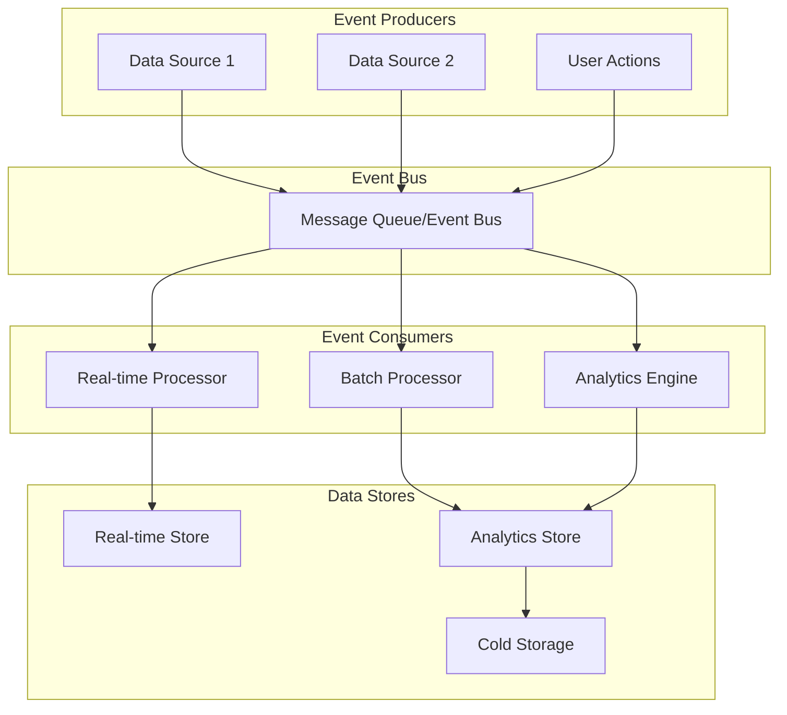
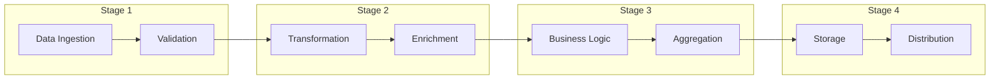
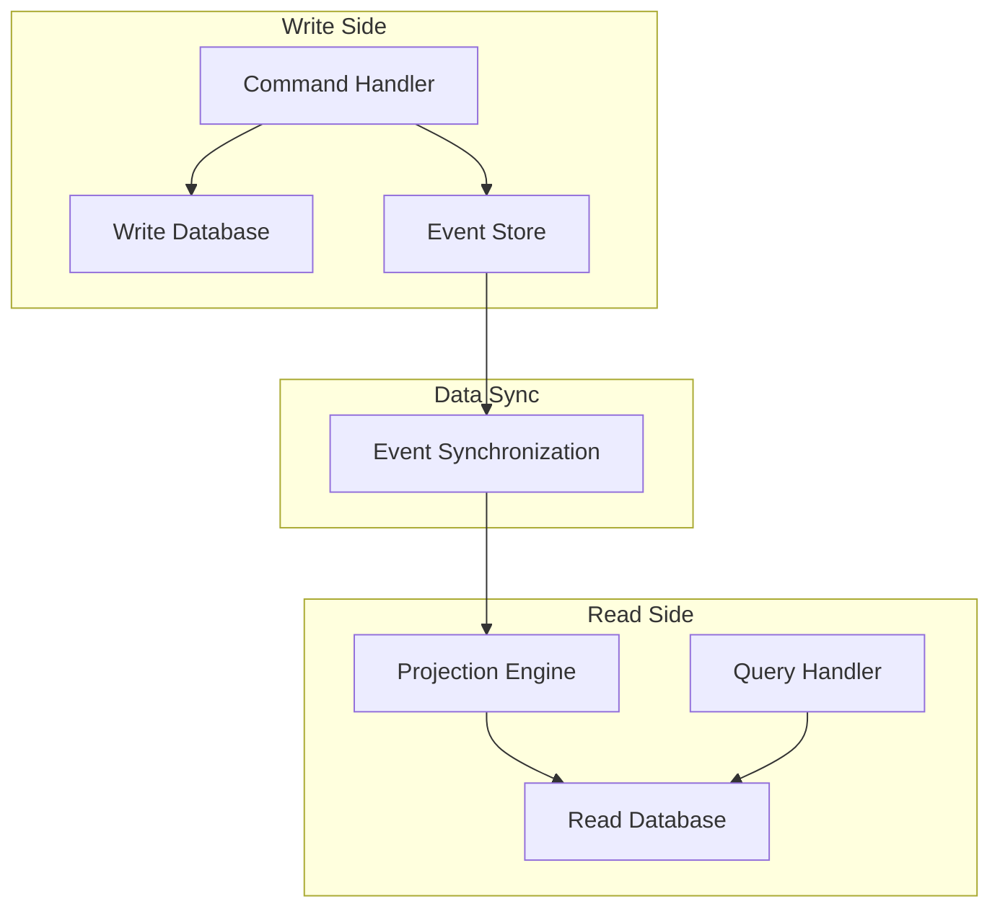
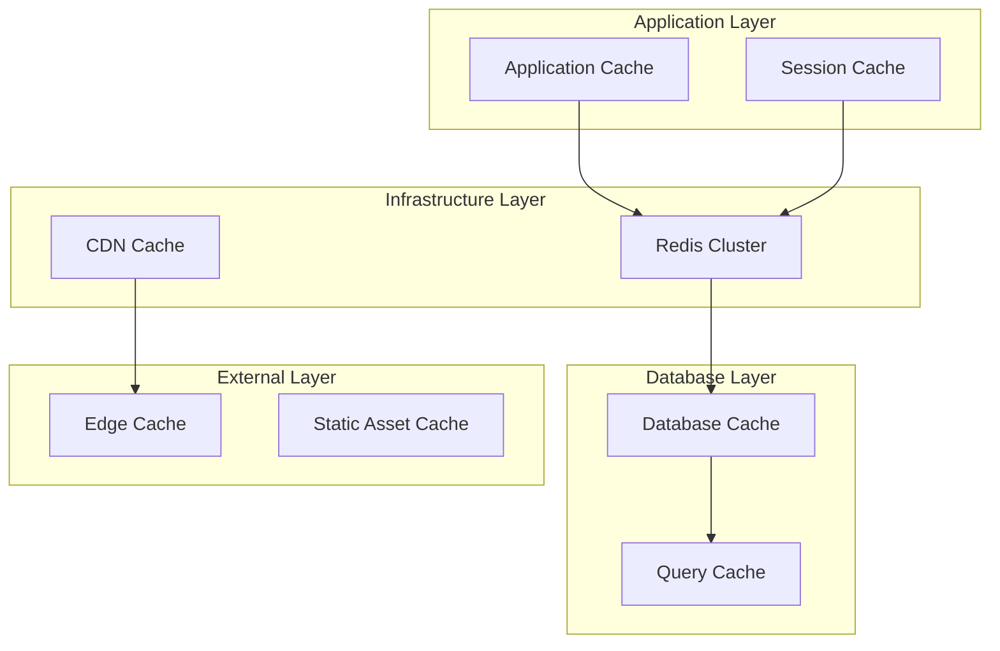
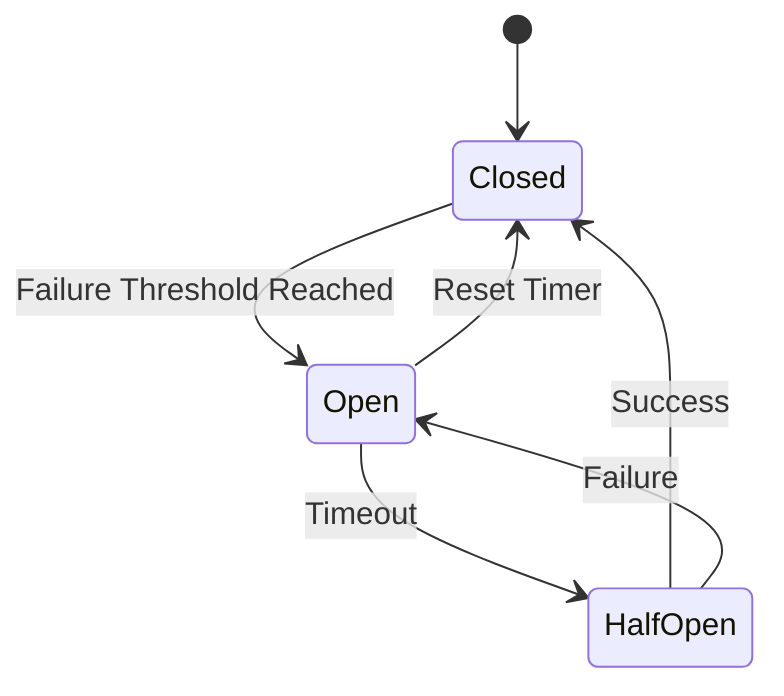

# Data Flow Patterns Guide

## Overview

This guide provides comprehensive data flow patterns and best practices for creating detailed data flow specifications. It includes visual diagram patterns, processing pipeline templates, caching strategies, and error handling approaches for various system types.

## Data Flow Architecture Patterns

### 1. Event-Driven Architecture Pattern


**When to Use**: Real-time systems, high-throughput data processing, microservices architectures
**Key Characteristics**: Asynchronous processing, loose coupling, scalability
**Performance Considerations**: Message queue sizing, consumer scaling, backpressure handling

### 2. Pipeline Architecture Pattern


**When to Use**: ETL processes, data processing workflows, analytics pipelines
**Key Characteristics**: Sequential processing, stage-specific optimization, error handling per stage
**Performance Considerations**: Stage throughput balancing, parallel processing opportunities

### 3. CQRS (Command Query Responsibility Segregation) Pattern


**When to Use**: High-performance read/write systems, complex business logic, scalability requirements
**Key Characteristics**: Separate read/write models, eventual consistency, optimized data structures
**Performance Considerations**: Read model optimization, synchronization lag handling

## Data Processing Pipeline Patterns

### 1. Stream Processing Pattern
```yaml
Real-time Processing Pipeline:
  Data Source: [Source Type]
  Processing Window: [Window Type and Size]
  Latency Requirement: [SLA in ms]

  Stages:
    1. Ingestion:
       - Protocol: [Kafka/Kinesis/etc]
       - Serialization: [JSON/Avro/Protobuf]
       - Buffer Size: [Size configuration]
       - Parallel Consumers: [Number]

    2. Filtering:
       - Filter Rules: [Business rules]
       - Early Filtering: [Optimization]
       - Complex Event Processing: [CEP capabilities]

    3. Transformation:
       - Data Mapping: [Field transformations]
       - Validation: [Data quality checks]
       - Enrichment: [External data joins]

    4. Aggregation:
       - Windowing: [Time/Session/Global]
       - Aggregation Functions: [SUM/AVG/COUNT/etc]
       - State Management: [State store configuration]

    5. Output:
       - Sink Types: [Database/API/File/etc]
       - Batching: [Batch size and timing]
       - Error Handling: [Dead letter queue]
```

### 2. Batch Processing Pattern
```yaml
Batch Processing Pipeline:
  Schedule: [Cron expression]
  Data Volume: [Expected data size]
  Processing Window: [Time window]

  Stages:
    1. Data Extraction:
       - Source Systems: [List of sources]
       - Extraction Method: [Full/Incremental]
       - Data Validation: [Pre-processing checks]

    2. Data Loading:
       - Staging Area: [Temporary storage]
       - Data Cleansing: [Quality improvements]
       - Deduplication: [Duplicate handling]

    3. Business Processing:
       - Business Rules: [Rule application]
       - Calculations: [Business logic]
       - Data Validation: [Post-processing checks]

    4. Data Distribution:
       - Target Systems: [Output destinations]
       - Load Strategy: [Replace/Append/Upsert]
       - Notification: [Completion alerts]

  Error Handling:
    - Retry Logic: [Number of retries]
    - Alerting: [Error notifications]
    - Manual Intervention: [Escalation procedures]
```

## Caching Strategy Patterns

### 1. Multi-Level Caching Pattern


### 2. Cache Invalidation Patterns
```yaml
Invalidation Strategies:

  1. Time-Based Invalidation:
     - TTL Configuration: [Time values]
     - Scheduled Refresh: [Refresh schedule]
     - Peak Time Optimization: [Performance tuning]

  2. Event-Driven Invalidation:
     - Event Sources: [Change triggers]
     - Propagation Strategy: [Cascade effects]
     - Selective Invalidation: [Key patterns]

  3. Manual Invalidation:
     - Admin Interface: [Management tools]
     - API Endpoints: [Programmatic control]
     - Emergency Procedures: [Critical updates]

  4. Predictive Invalidation:
     - Usage Patterns: [Machine learning]
     - Pre-warming: [Proactive loading]
     - Capacity Planning: [Resource allocation]
```

## Error Handling Patterns

### 1. Circuit Breaker Pattern


### 2. Retry Pattern with Exponential Backoff
```yaml
Retry Strategy:
  Initial Delay: [Starting delay]
  Maximum Delay: [Upper limit]
  Backoff Multiplier: [Multiplication factor]
  Maximum Attempts: [Retry limit]

  Implementation:
    1. Immediate Retry:
       - Retry Count: [Immediate attempts]
       - Use Cases: [Transient errors]

    2. Exponential Backoff:
       - Delay Calculation: [Backoff formula]
       - Jitter: [Randomization]
       - Use Cases: [Resource exhaustion]

    3. Circuit Breaker:
       - Failure Threshold: [Error count]
       - Recovery Timeout: [Wait period]
       - Use Cases: [System overload]
```

## Data Quality Patterns

### 1. Data Validation Pipeline
```yaml
Validation Stages:
  1. Schema Validation:
     - Structure Checks: [Required fields]
     - Type Validation: [Data type checking]
     - Range Validation: [Value constraints]

  2. Business Rule Validation:
     - Rule Engine: [Business logic]
     - Cross-Field Validation: [Field relationships]
     - Historical Validation: [Trend analysis]

  3. Referential Integrity:
     - Foreign Key Checks: [Reference validation]
     - Lookup Validation: [Master data checks]
     - Consistency Checks: [Cross-system validation]

  4. Data Quality Scoring:
     - Completeness: [Missing data assessment]
     - Accuracy: [Correctness validation]
     - Timeliness: [Freshness checking]
     - Consistency: [Format standardization]
```

## Monitoring and Observability Patterns

### 1. Data Flow Monitoring
```yaml
Monitoring Components:
  1. Metrics Collection:
     - Throughput: [Messages/second]
     - Latency: [Processing time]
     - Error Rates: [Error percentages]
     - Resource Usage: [CPU/Memory/Network]

  2. Log Aggregation:
     - Structured Logging: [JSON format]
     - Correlation IDs: [Request tracking]
     - Log Levels: [Severity classification]
     - Retention Policies: [Storage management]

  3. Tracing:
     - Distributed Tracing: [End-to-end tracking]
     - Span Creation: [Operation tracking]
     - Performance Analysis: [Bottleneck identification]

  4. Alerting:
     - Threshold Configuration: [Alert triggers]
     - Escalation Policies: [Notification rules]
     - Alert Enrichment: [Context information]
     - Alert Suppression: [Noise reduction]
```

## Performance Optimization Patterns

### 1. Data Partitioning Strategy
```yaml
Partitioning Approaches:
  1. Horizontal Partitioning:
     - Key-based: [Hash distribution]
     - Range-based: [Value ranges]
     - Geographic: [Location-based]

  2. Vertical Partitioning:
     - Column-based: [Feature separation]
     - Access Pattern: [Usage optimization]
     - Hot/Cold Data: [Frequency-based]

  3. Time-based Partitioning:
     - Date Ranges: [Temporal separation]
     - Retention Policies: [Lifecycle management]
     - Archival Strategy: [Long-term storage]
```

### 2. Connection Pooling Pattern
```yaml
Connection Management:
  Pool Configuration:
    - Initial Size: [Starting connections]
    - Maximum Size: [Connection limit]
    - Timeout Settings: [Connection time limits]
    - Validation Queries: [Health checks]

  Pool Strategies:
    1. Static Pooling:
       - Fixed Size: [Constant connections]
       - Predictable Load: [Stable usage patterns]

    2. Dynamic Pooling:
       - Auto-scaling: [Adaptive sizing]
       - Load-based: [Demand-driven]
       - Resource Optimization: [Efficient usage]

    3. Lazy Initialization:
       - On-demand: [Just-in-time creation]
       - Resource Conservation: [Efficient startup]
       - Cold Start Mitigation: [Performance optimization]
```

## Security Patterns

### 1. Data Encryption Flow
```yaml
Encryption Strategy:
  1. In Transit:
     - TLS Configuration: [Protocol version]
     - Certificate Management: [Certificate lifecycle]
     - Key Exchange: [Secure key establishment]

  2. At Rest:
     - Database Encryption: [Transparent encryption]
     - File Encryption: [File-level security]
     - Key Management: [Secure key storage]

  3. Application Level:
     - Field Encryption: [Sensitive data protection]
     - Tokenization: [Data substitution]
     - Access Control: [Permission-based access]
```

### 2. Audit Trail Pattern
```yaml
Audit Implementation:
  Event Types:
    - Data Access: [Read operations]
    - Data Modification: [Write operations]
    - System Events: [Administrative actions]
    - Security Events: [Authentication/Authorization]

  Audit Storage:
    - Immutable Logs: [Write-once storage]
    - Tamper Detection: [Integrity checks]
    - Long-term Retention: [Compliance requirements]
    - Privacy Controls: [Data masking]

  Audit Analysis:
    - Pattern Detection: [Anomaly identification]
    - Compliance Reporting: [Regulatory requirements]
    - Forensic Analysis: [Investigation support]
    - Trend Analysis: [Behavior patterns]
```

---

**Guide Version**: 1.0
**Last Updated**: [DATE]
**Scope**: Comprehensive data flow patterns
**Target Audience**: System architects, data engineers, DevOps engineers