# Mermaid Diagram Templates

Ready-to-use templates for common specification diagrams.

## Component Diagram Templates

### Basic System Architecture
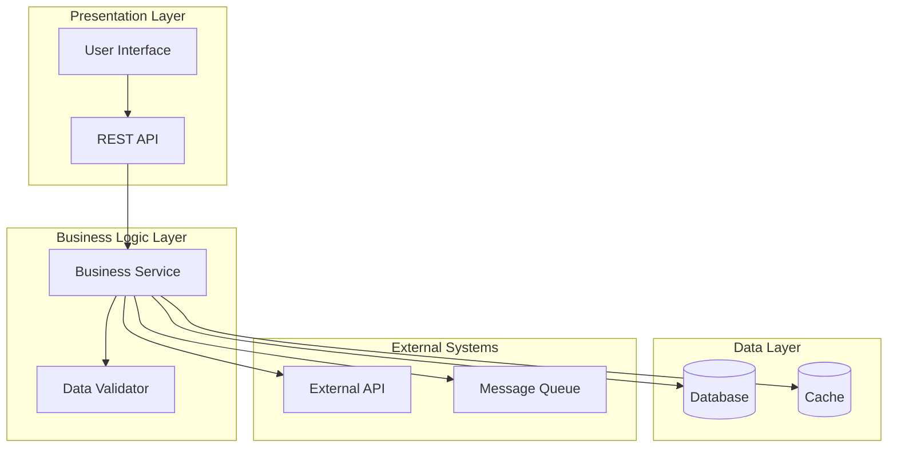

### Microservices Architecture
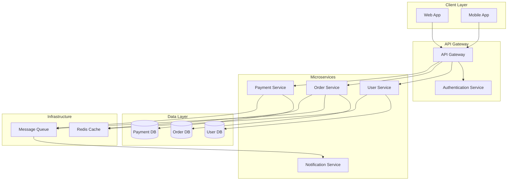

### Real-time System Architecture
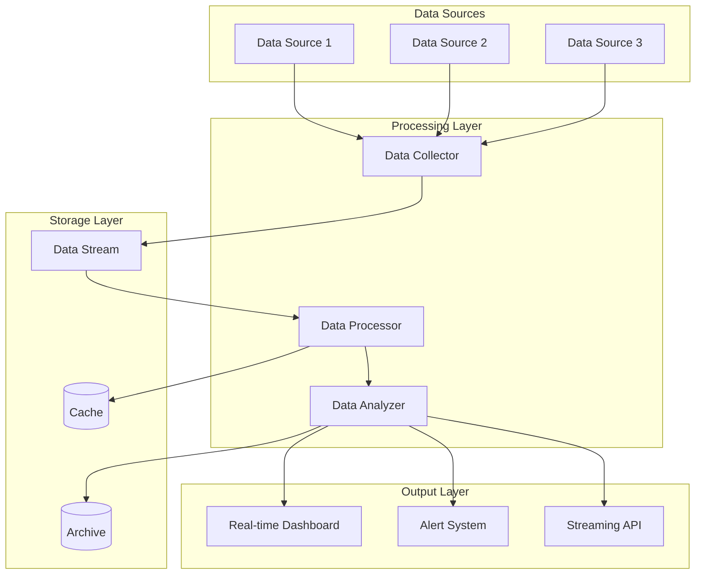

## Sequence Diagram Templates

### User Authentication Flow
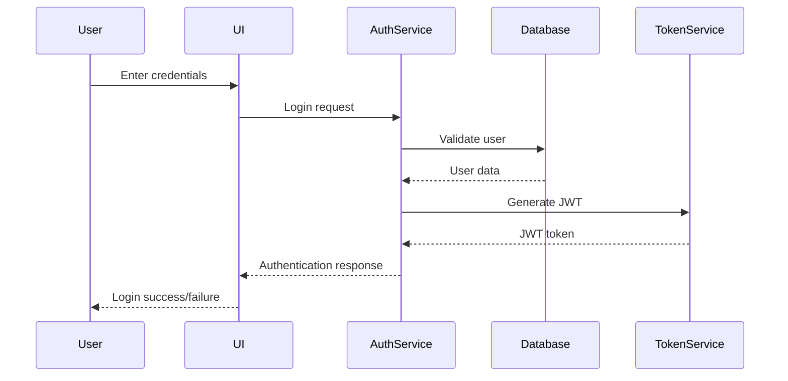

### Order Processing Flow
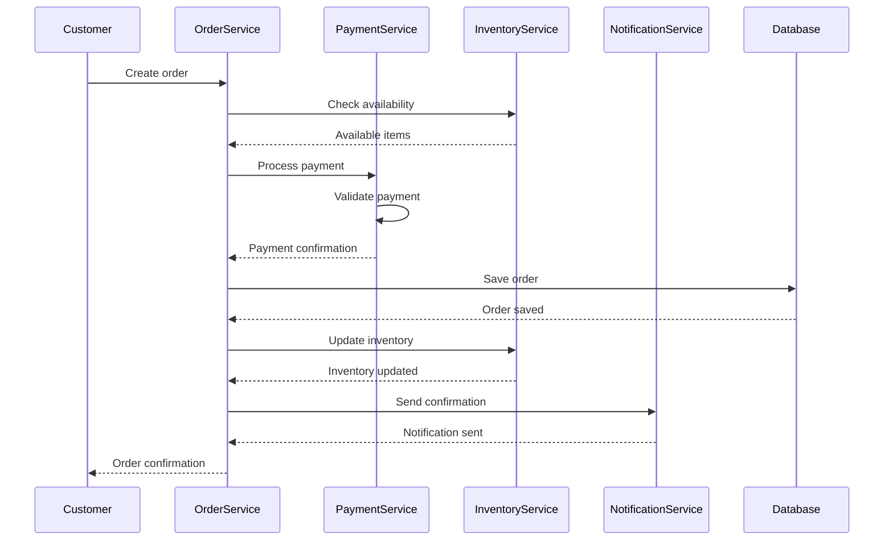

### API Request Flow
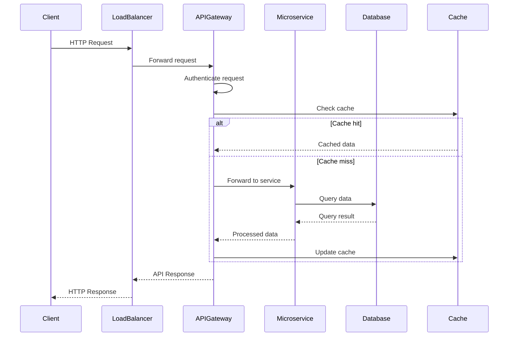

### Error Handling Flow
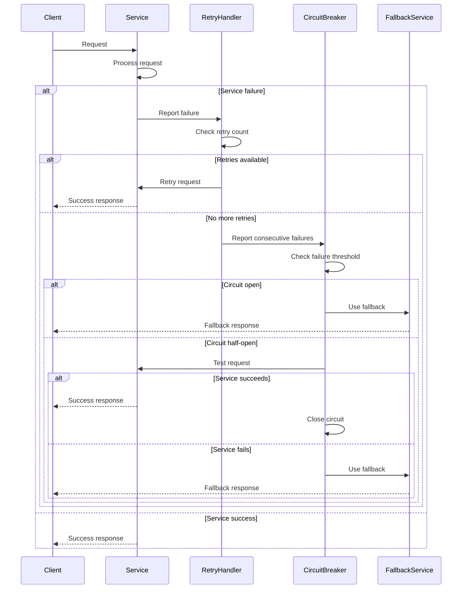

## State Diagram Templates

### Order Lifecycle
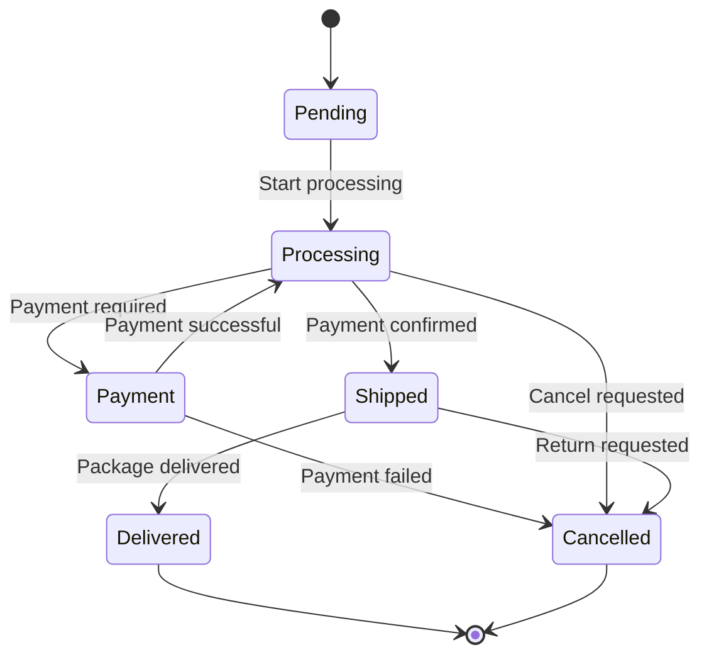

### User Session State
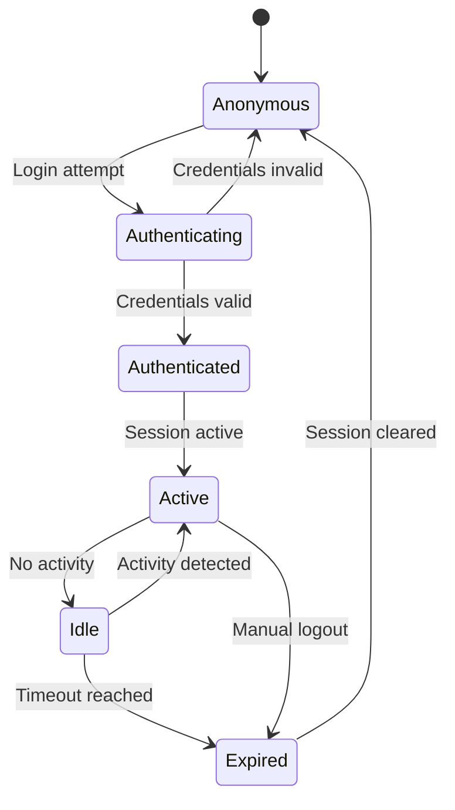

### Circuit Breaker States
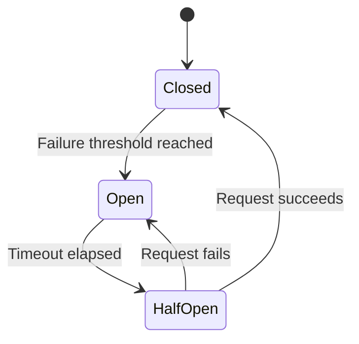

## Flowchart Templates

### Data Processing Pipeline
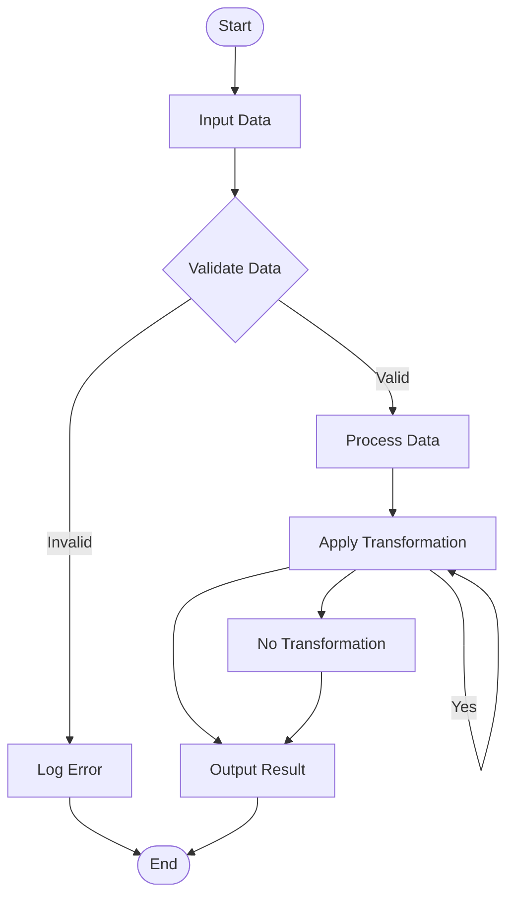

### Decision Making Process
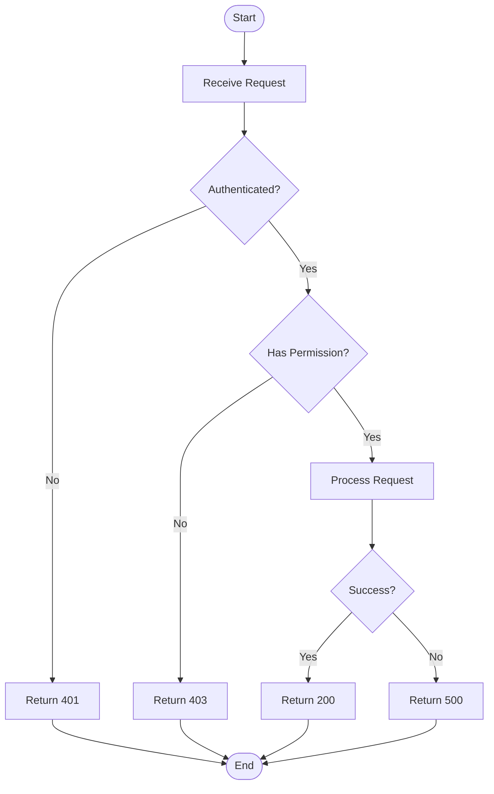

## ER Diagram Templates

### User Order System
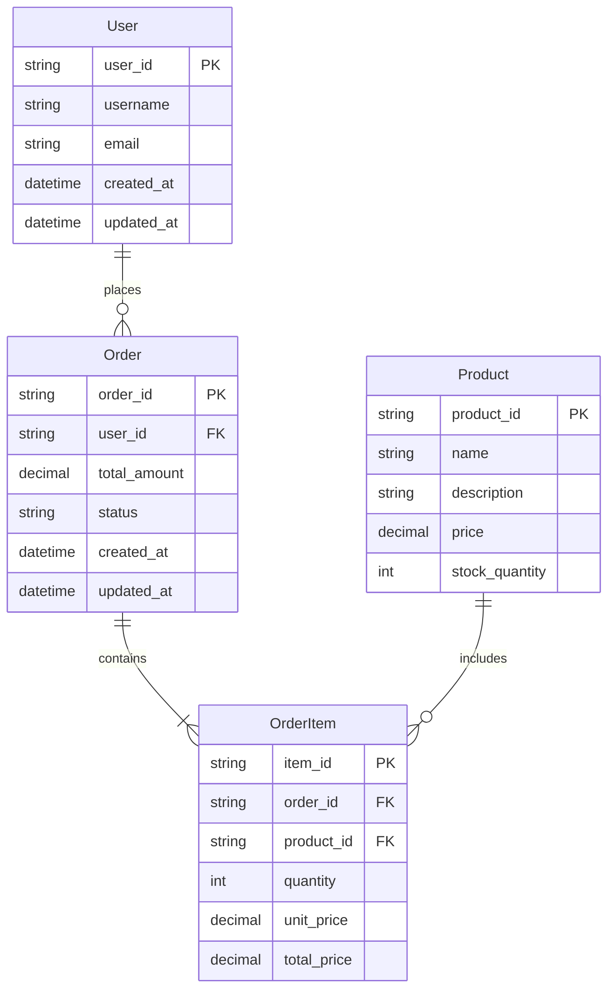

### Blog System
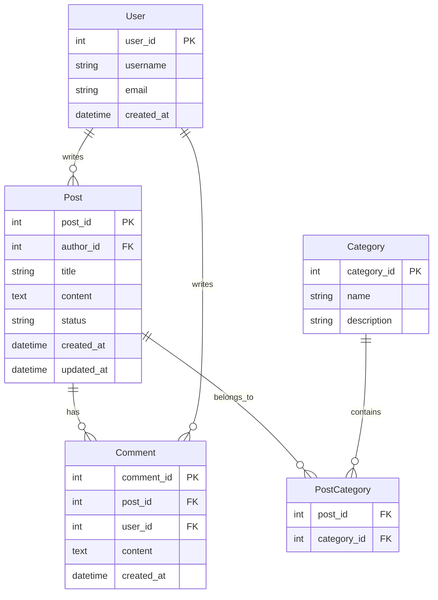

## Usage Guidelines

### Component Diagrams
- Use for high-level architecture overview
- Group related components into layers or modules
- Show data flow and dependencies
- Include external systems and integrations

### Sequence Diagrams
- Use for showing interaction between components over time
- Focus on specific use cases or scenarios
- Include error handling paths
- Show both happy path and exceptional flows

### State Diagrams
- Use for objects with complex lifecycle states
- Show all possible states and transitions
- Include events that trigger state changes
- Consider concurrent states if applicable

### Flowcharts
- Use for business processes and decision logic
- Keep diagrams simple and readable
- Use consistent shapes for different elements
- Include error handling and alternative paths

### ER Diagrams
- Use for database schema design
- Show entities, attributes, and relationships
- Include cardinality and constraints
- Normalize relationships appropriately

## Customization Tips

### Styling
- Add colors to distinguish different layers or types
- Use consistent color schemes across diagrams
- Consider accessibility (colorblind-friendly palettes)

### Layout
- Arrange components logically (left to right, top to bottom)
- Minimize crossing lines
- Group related components together

### Labels
- Use clear, descriptive names
- Include relevant details (protocols, data formats)
- Add annotations for complex interactions

### Best Practices
- Keep diagrams focused on a single concern
- Don't overcrowd with too much detail
- Use multiple diagrams for complex systems
- Maintain consistency across related diagrams